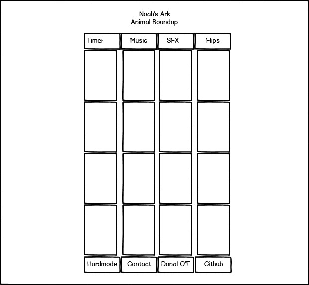
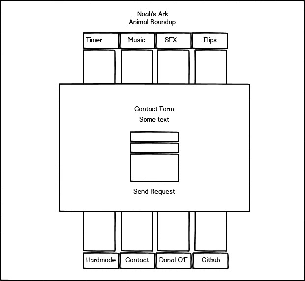

 
# Noah's Ark: Animal Roundup
by Donal O'Farrell
 
Milestone Project 2: Interactive Development - Code Institute 
 
[Noah's Ark: Animal Roundup](https://dof-bull.github.io/ci_milestone_project_2_noahs_ark_animal_roundup/) is a card matching game designed for children though also has an appeal to adults with a competitive streak. Features including click-to-play controls, two levels of difficulty, jungle themed animations and animal graphics for an overall enjoyable experience.
 
[Play now!](https://dof-bull.github.io/ci_milestone_project_2_noahs_ark_animal_roundup/)

## Table of Contents
1. [**UX**](#ux)
    - [**Project Goals**](#project-goals)
    - [**Player goals**](#player-goals)
    - [**Developer Goals**](#developer-goals)
    - [**User Stories**](#user-stories)
    - [**Design choices**](#design-choices)
    - [**Wireframes**](#wireframes)

2. [**Features**](#features)
    - [**Existing Features**](#existing-features)
    - [**Features Left to Implement**](#features-left-to-implement)

3. [**Technologies used**](#technologies-used)

4. [**Testing**](#testing)
    - [**Code Validators**](#code-validators)
    - [**Testing Devices**](#testing-devices)
    - [**Testers**](#testers)
    - [**Feature Testing**](#feature-testing)
    - [**Difficulties Encountered**](#difficulties-encountered)

5. [**Deployment**](#deployment)
    - [**How to run this project locally**](#how-to-run-this-project-locally)

6. [**Credits**](#credits)
    - [**Content**](#content)
    - [**Media**](#media)
    - [**Acknowledgements**](#acknowledgements)
 
## UX
 
#### Project Goals
The main goal of Noah's Ark: Animal Roundup is to provide an entertaining experience for its user, whether child or adult. The game was aimed to be fully playable whether on desktop or on a mobile device.
 
#### Player Goals
The player's goals are to enjoy the experience and to do this they have a variety of fun animal images, catchy music, biblical themed cursor and a little bit of a jump if they get a gameover.
 
For mobile users, your final result is formatted to all be in one easy screenshot including your victory, flips it took you and even if you were playing on hard mode. I pictured this as something you would use as bragging rights to any other friends also playing. I remember the fads of Flappy Bird and Temple Run where this was very common.
 
#### Developer Goals
The developer's goals was to make a project that showed a broad range of HTML, CSS and Javascript skills for portfolio purposes. This also included a contact form direct to the developer's email plus a link to their Github page.
 
#### User Stories
As a child or an adult user of the game, I want:
1. It to be easy to understand and easy to work out how to play.
2. Audio and visual feedback so that I know when I have clicked on something.
3. Positive audio feedback when I complete a step in the game (for example when I find a matching pair of cards), because this increases my enjoyment from playing.
4. Images that I recognise so that I understand when I have achieved something in the game.
 
As purely an adult user of the game, I may also want:
1. The ability to mute the music and SFX noises from the game if they start getting annoying.
2. A higher difficulty level for bragging rights.
3. The ability to know and contact who made the game.
4. The ability to be able to see more of the developer's work.
 
#### Design Choices
 
- **Font:** Bubblegum Sans was chosen for its whimsical, fun style plus it popped nicely when given a black outline.
- **Icons:** The music, SFX and reset icons were all chosen for their obvious, commonly used meanings. The clock for the hardmode icon highlighted that the time is affected. The cursor was chosen to highlight the story of Noah's Ark without making it too biblical for a growing secular audience.
- **Colours:** The colours were chosen to continue the jungle and bush themes created by the background image, grass and vine imagery and rustling noises.
- **Styling:** Colours were kept as consistent as possible with also taking in visibility vs the background into consideration.
- **Backgrounds:** The tropical image was chosen to continue the tropical jungle theme as encouraged by the audio, animal choices and plant graphics.
- **Card Images:** The choice of the animals was to gently encourage the Noah's Ark theme which to the developer seemed like a natural "two by two" pairing formula. Several other animal images such as a lion were originally used but then discarded when it was realized the mating pair don't look the same as each other.
- **Audio Files:** The Caribbean themed song was chosen as it was upbeat and fun without any distracting lyrics. The victory song continued the Caribbean theme while sounding a lot more martine. The game-over storm music was chosen to add a little shock factor and make avoiding a game over something to be desired. The bush rustling sound worked well to give the illusion of the 'searching each bush with your staff (cursor)'.
 
#### Wireframes
 
###### Main Page
 

 
###### Contact Form
 

 
## Features
 
#### Existing Features
- **Time Counter:** Gives the user a visual representation of how long they have left to finish the game. Also helps add an element of suspense. NOTE: On hardcode mode the timer ticks down at twice the speed rather then the visual number starting lower. This is an unintentional element of the design.
- **Music/SFX Toggles:** Allows the user to turn off audio elements they might not enjoy. These toggle choices stay consistent through a victory, game over or reset to avoid user frustration.
- **Reset Button:** Allows the user to start over again on a new game rather than having to wait for a game over or victory. Can allow the user to try to get a better score without getting frustrated waiting. This also recalls music, SFX and hardmode toggle choices.
- **Flip Counter:** Gives the user a visual representation of how many flips they have taken so far in the game. This is also given as a score in the victory screen to encourage replayability to achieve a lower amount of flips.
- **Hardmode:** Allows the user to try the game at a harder level where they only have half the amount of time to try finish the game. Due to an unintentional element of the design, the timer ticks down at twice the speed rather than the visual number starting lower. If the user does finish the game on hardmode, this is visually noted on the victory screen to add to the accomplishment.
- **Contact Form:** This allows users to get directly in touch with the developer with an easy to use form requesting name, email and their project request. This is sent directly to the developer.
- **Github Link:** The developer's name is fully visible and a direct link to their Github page is available. This will open a new tab rather than accidently leave the game.
 
#### Features Left to Implement
- For the game to pause when the contact form window is open.
- For the timer to more accurately reflect the reduced time when on hardmode.
 
## Technologies Used
 
This project uses HTML, CSS and JavaScript programming languages.
- [Gitpod](https://gitpod.io/workspaces/) 
    - Developer used **Gitpod** for their IDE while building the website.
- [Bootstrap](https://www.bootstrapcdn.com/)
    - The project uses Bootstrap to provide icons from [FontAwesome](https://www.bootstrapcdn.com/fontawesome/)
- [Google Fonts](https://fonts.google.com/)
    - The project uses **Google fonts** to style the website fonts.
- [GitHub](https://github.com/)
    - This project uses **GitHub** to store and share all project code remotely. 
- [Photoshop](www.adobe.com/Photoshop)
    - This project used tools in **Photohshop** to edit, crop and save images as well as utilising the colour picker to ensure color consistency over the entire project.
- [AutoPrefixer](https://autoprefixer.github.io/)
    - The project used **AutoPrefixer** to make sure all css prefixes were the most up to date versions. 
 
## Testing
 
#### Code Validators
- [Dillinger](https://dillinger.io/)
This was used for Markdown in this README.md.
 
- [W3](http://validator.w3.org/)
This was used to check the HTML and CSS in this project.
 
- [JSHint](https://jshint.com/)
This was used to check the JavaScript in this project.
 
#### Testing devices
- Desktop 
- iphone 6
- Huawei P30 lite
 
#### Testers
Special thanks to:
- Aria Keane (6)
- Amy Buckley (28)
- Jo O'Farrell (60+)

The wide age gap between the testers gave the developer a better understanding of certain diffuclties and expectations e.g. original background music was too intense for the 6 year old.

#### Feature Testing
- **Time Counter:** Accurately counts down time in normal mode. Double ticks on hardmode (explained below). Successfully triggers Game Over when it hits zero.
- **Music/SFX Toggles:** Both toggles fully work on desktop and mobile and toggle position remains as selected when reset or hardmode is triggered.
- **Reset Button:** Rest button works on both desktop and mobile devices. Fully returns cards face down, in new positions and resets timer and flip count.
- **Flip Counter:** Accurately reflects the number of flips clicked. Does not count up when illegal clicks occur. Resets on game over, victory and new game.
- **Hardmode:** Successfully triggers hardmode which resets into a new game where clock ticker goes down twice as fast. Not ideal but explained below. This also successfully triggers a statement declaring the user won on hardmode if they get a victory screen while it's toggled.
- **Contact Form:** Form opens when click on desktop and mobile and closes when top right x is clicked, anywhere outside the box is clicked. Email sends to the developer with the name, email address and message when 'Send Request' is clicked.
- **Github Link:** Successfully links to Github page on both desktop and mobile device.
 
#### Difficulties Encountered
- The biggest difficulty faced in this project was trying to bring in a fully functional hardmode without having to rewrite the entire code. It was found that trying to create a separate hardmode function broke the code all over the place. The work around was for a hardmode toggle to cause the timer to go down twice as fast though still visually showing the original 100 seconds.
 
- The option of hardmode adding more cards instead of a reduced time was highly considered but it was decided that this would not function on mobile devices due to cards being too small so it was dropped for a time challenge instead. The ability to keep it accessible for mobile devices was considered worth it.
 
- After getting all the music and sfx toggles fully functional, a new difficulty arose when the reset button started a total new game and put the toggle back to their starting positions which is on by default. This was fully worked through in the end and is fully functional as intended.
 
- Displaying the final flip count in the victory screen proved to be more difficult than originally thought but was solved by making a clone function of flips called score.
 
- Keeping the card sizes viable for mobile took a lot of playing around with media queries but this was achieved.
 
- A sound issue encountered with ios devices was that audio no longer plays automatically without a user interaction triggering in. This was fine with the background, victory and SFX sounds as all require an action to start but it means the gameover storm audio doesn't trigger as it is caused by time running out rather than a direct player interaction. A work around could have been made with an audio play button on the gameover screen but was decided this would look too out of place and was dropped.
 
- Have observed the custom cursor not applying across the button of the screen when on desktop. This has remained the case as the issue was never solved.
 
## Deployment
 
This project was developed using Gitpod based on a template provided by Code Institute, committed to git and pushed to GitHub.
 
To deploy Noah's Ark: Animal Roundup to GitHub Pages from its [GitHub repository](https://github.com/dof-bull/ci_milestone_project_2_noahs_ark_animal_roundup), the following steps were taken: 
1. Log into GitHub. 
2. From the list of repositories on the screen, select **dof-bull/ci_milestone_project_2_noahs_ark_animal_roundup**.
3. From the menu items near the top of the page, select **Settings**.
4. Scroll down to the **GitHub Pages** section.
5. Under **Source** click the drop-down menu labelled **None** and select **Master Branch**
6. On selecting Master Branch the page is automatically refreshed, Noah's Ark: Animal Roundup  is now deployed. 
7. Scroll back down to the **GitHub Pages** section to retrieve the link to the deployed website.
 
### How to run this project locally
 
To clone this project from GitHub:
1. Follow this link to the [Noah's Ark: Animal Roundup GitHub repository](https://github.com/dof-bull/ci_milestone_project_2_noahs_ark_animal_roundup).
2. Under the repository name, click "Clone or download".
3. In the Clone with HTTPs section, copy the clone URL for the repository. 
4. In your local IDE open Git Bash.
5. Change the current working directory to the location where you want the cloned directory to be made.
6. Type ```git clone```, and then paste the URL you copied in Step 3.
```console
git clone https://github.com/dof-bull/ci_milestone_project_2_noahs_ark_animal_roundup
```
7. Press Enter. Your local clone will be created.
 
 
## Credits
 
### Content
- Web Dev Simplified and PortEXE for their tutorials which form a strong foundation of this project.
How to Code a Card Matching Game(https://www.youtube.com/watch?v=28VfzEiJgy4&feature=youtu.be)
How To Code A Card Game In Plain JavaScript - Spooky Halloween Edition(https://www.youtube.com/watch?v=3uuQ3g92oPQ&feature=youtu.be)
 
- bouderbabari via rw-designer.com for the great staff cursor icon.
Ekos Jesus Stick Icon Details(http://www.rw-designer.com/icon-detail/4492)
 
- GoogleFonts for the BubblegumSans font.
(https://fonts.google.com/specimen/Bubblegum+Sans)
 
- AutoPrefixer for tidying up the order of my web prefixes.
(https://autoprefixer.github.io/)
 
- w3schools for their great mini tutorial on modals.
(https://www.w3schools.com/howto/howto_css_modals.asp)
 
### Media
- Martin Berube via IronArchive for the adorable animal icons.
Iconset: Animal Icons by Martin Berube (46 icons)(https://iconarchive.com/show/animal-icons-by-martin-berube.html)
 
- Roa Music via free-stock-music.com for the wonderful and positive electronic track.
Remember(https://www.free-stock-music.com/roa-music-remember.html)
Remember by Roa Music | https://soundcloud.com/roa_music1031
Music promoted by https://www.free-stock-music.com
Creative Commons Attribution 3.0 Unported License
https://creativecommons.org/licenses/by/3.0/deed.en_US
 
- Vlad Gluschenko via free-stock-music.com for the wonderful and positive electronic track.
Boat(https://www.free-stock-music.com/vlad-gluschenko-boat.html)
Boat by Vlad Gluschenko | https://soundcloud.com/vgl9
Music promoted by https://www.free-stock-music.com
Creative Commons Attribution 3.0 Unported License
https://creativecommons.org/licenses/by/3.0/deed.en_US
 
- SoundBible.com for their storm sound file.
Perfect Thunder Storm Sound(http://soundbible.com/916-Perfect-Thunder-Storm.html)
 
- Fesliyan Studios for their free foliage sound effects.
Hitting Bushes Branches G Sound Effect(https://www.fesliyanstudios.com/royalty-free-sound-effects-download/foliage-270)
 
- Nikita Golubev via flaticon.com for their grass icon.
Grass free icon(https://www.flaticon.com/free-icon/grass_2897293)
 
- Freepik via flaticon.com for their vines icon.
Vines free icon (https://www.flaticon.com/free-icon/vines_3195853?term=vines&page=2&position=62)
 
- Font Awesome for access to their volume and power icons.
Volume Off(https://fontawesome.com/v4.7.0/icon/volume-off)
Volume On(https://fontawesome.com/v4.7.0/icon/volume-up)
Power Off (https://fontawesome.com/v4.7.0/icon/power-off)
 
- Lovepik.com for their tropical rain forest image.
(https://lovepik.com/image-500648859/tropical-rain-forest-in-bohol-island-philippines.html)
 
- prettysleepy1 via Pixabay for the stormy sea image.
(https://pixabay.com/photos/seascape-clouds-storm-horizon-hope-4240264/)
 
### Acknowledgements
 
- Anthony Ngene as my project mentor and for his help in the reset button and music toggle button.
(https://github.com/tonymontaro)
 
- Web Dev Simplified for a greater understanding on how to 3D flip something using CSS.
3D Flip Button Tutorial(https://www.youtube.com/watch?v=_isJ_SpN7T0)
 
- w3wchools.com for a better understanding of how keyframe animations work.
CSS @keyframes Rule(https://www.w3schools.com/cssref/css3_pr_animation-keyframes.asp)
 
- w3wchools.com for a quick reminder on how to do comments in Javascript.
Single Line Comments(https://www.w3schools.com/js/js_comments.asp)
 
- w3wchools.com for a better understanding of how the Math.Random function works.
JavaScript Random(https://www.w3schools.com/js/js_random.asp)
 
- StackOverFlow for getting my jshint to calm down with the errors.
Why does JSHint throw a warning if I am using const?(https://stackoverflow.com/questions/27441803/why-does-jshint-throw-a-warning-if-i-am-using-const)
 
- StackOverFlow for the explanation on tab icons and how to insert one.
How to add a browser tab icon (favicon) for a website?(https://stackoverflow.com/questions/4888377/how-to-add-a-browser-tab-icon-favicon-for-a-website)
 
- Ginifab for their excellent color picker app so I could get the HEX from images.
(https://www.ginifab.com/feeds/pms/color_picker_from_image.php).
 
- Coolors.co for use of their color palette generator. 
(https://coolors.co/0071bd-fffffc-2a2b2a-a8763e).
 
- Css-tricks.com for the list of media query sizes.
(https://css-tricks.com/snippets/css/media-queries-for-standard-devices/)
 
- Css-tricks.com for the simple explanation of helping text pop out over images.
(https://css-tricks.com/design-considerations-text-images/)
 
- Css-tricks.com for the lesson in colour stroking.
(https://css-tricks.com/adding-stroke-to-web-text/)
 
- Pixlr.com for their fantastic image editor that allows you to keep its transparency.
(https://pixlr.com/x/)
 
- CanIUse.com for clarification about the backface use for IOS devices.
(https://caniuse.com/#search=backface-visibility)
 
- ReduceImages.com so I could lower the resolution of the background image for faster loading speeds. 
(https://www.reduceimages.com/)
 